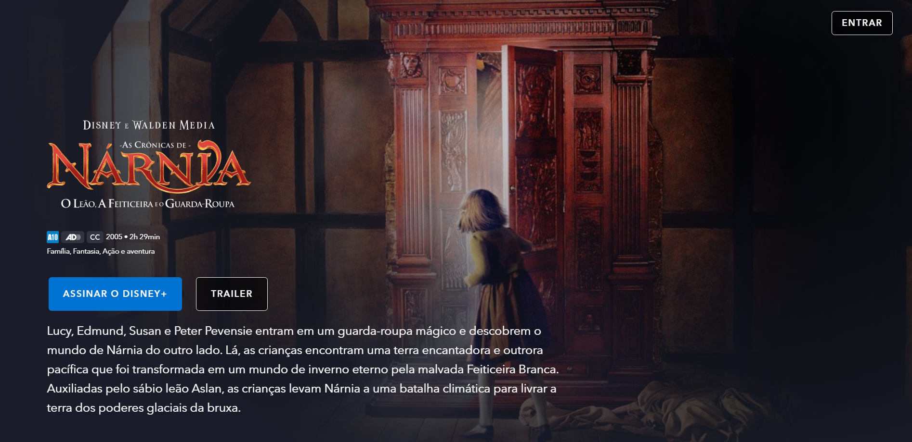

# Clone disney+
Clone da landing page do meu filme favorito da Disney+.
Esta aplicação está disponível online no endereço: [File Disney+](https://clone-disney-filme.vercel.app/).

## Tecnologias utilizadas
- HTML5
- CSS3
- JavaScript
- SASS
- Gulp

## Como rodar o projeto
- Baixar ou clonar este repositório, no terminal executar `npm i` ou `npm install`
- Para executar o gulp, usar o comando `npm run dev`
- Em seguida abrir o arquivo index.html no navegador padrão
